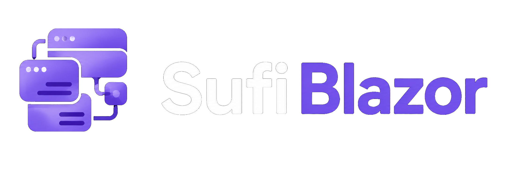

# SufiBlazor



[](LICENSE)
[](https://git.sabp.ir/sufi-chain/sufi-blazor)

SufiBlazor is an independent Blazor UI component library and design system for ASP.NET Core 10+ applications. It can be used inside Sufi Platform, but it is not tied to Sufi Platform, ABP, SufiTheme, or any other third-party application framework. Any Blazor project that targets modern ASP.NET Core can use it as its primary UI layer.

For Sufi Platform, SufiBlazor is the default component system used by generated hosts and first-party modules. Outside Sufi Platform, it can still be adopted on its own as a self-contained component library for forms, data display, overlays, navigation, theming, RTL support, and application-level UI composition.

## What SufiBlazor is

SufiBlazor provides:

- reusable `Sb*` components for interactive UI
- a design-token-based theming model
- RTL and Persian-friendly UI support alongside standard LTR usage
- date and range picker components that support Gregorian, Persian Shamsi, and Hijri scenarios
- a component set that does not depend on Bootstrap, Tailwind, ABP UI, or Blazorise

## Solution

Open `SufiBlazor.slnx` from the repository root to work on the component library, demo projects, and tests together.

The solution contains:

- `src/SufiChain.SufiBlazor/SufiChain.SufiBlazor.csproj`
- `src/SufiChain.SufiBlazor.Demo.Localization/SufiChain.SufiBlazor.Demo.Localization.csproj`
- `src/SufiChain.SufiBlazor.Demo/SufiChain.SufiBlazor.Demo.csproj`
- `tests/SufiChain.SufiBlazor.Tests.csproj`

## Repository

The canonical Git repository is `https://git.sabp.ir/sufi-chain/sufi-blazor`.

## Where it can be used

You can use SufiBlazor in:

- Sufi Platform hosts and modules
- ABP-based Blazor applications
- plain ASP.NET Core Blazor applications
- internal business applications that only need the component library without the rest of Sufi Platform

In other words, SufiBlazor is a standalone product that Sufi Platform consumes, not a component set that only works inside the platform.

## Relationship to Sufi Platform

Inside Sufi Platform:

- `SufiBlazor` provides the base UI component system
- `SufiTheme` provides the host shell, layout, and branded navigation frame
- `SufiAbp` provides the broader platform abstractions and host integration patterns

That relationship is important, but it should not hide the fact that SufiBlazor can also be used on its own in any Blazor project targeting ASP.NET Core 10+.

## What this docs section covers

This section focuses on the way Sufi Platform developers and product teams use SufiBlazor in real projects.

It covers:

- component categories and platform-facing usage patterns
- installation guidance for host applications
- localization, RTL, and theming behavior
- integration notes that matter when SufiBlazor is the UI base for a generated product

It does not try to become the complete internal engineering manual for the independent SufiBlazor repository.

## Documentation structure

```
docs/
├── components/         # Component reference by category
├── installation.md     # How to consume the library in a host app
├── localization.md     # Localization and RTL guidance
├── theming.md          # Theme usage and customization
├── overview.md         # Platform-facing usage overview
└── README.md           # This file
```

## License

SufiBlazor is licensed under the MIT License. See `LICENSE` for the full license text.

## When to read next

- Open `docs/installation.md` when you want to add SufiBlazor to a host application.
- Open `docs/overview.md` when you want guidance on how the platform uses the library.
- Open `docs/theming.md` and `docs/localization.md` when the product needs custom branding, RTL, or Persian-oriented behavior.
