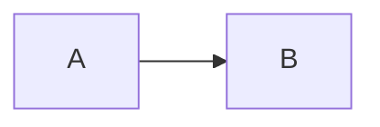

# SbMarkdownEditor

A markdown editor built on EasyMDE (CodeMirror 5 + marked.js) with live preview, offline mermaid/highlight.js rendering, source mode, AI diff review, and toolbar contributors.

## Parameters

| Parameter | Type | Default | Description |
|-----------|------|---------|-------------|
| Value | string | `""` | Markdown content (two-way bindable) |
| ValueChanged | EventCallback\<string\> | - | Fired when markdown changes |
| ValueHtml | string? | null | Rendered HTML from preview (optional two-way bind) |
| ValueHtmlChanged | EventCallback\<string?\> | - | Fired when preview HTML changes |
| ReadOnly | bool | false | Read-only editor |
| Disabled | bool | false | Disabled state |
| Placeholder | string? | null | Placeholder text |
| EnablePreview | bool | true | Enable live preview (ignored in source mode) |
| EnableMermaid | bool | true | Render ` ```mermaid ` blocks in preview |
| EnableHighlight | bool | true | Syntax-highlight fenced code blocks |
| HighlightTheme | string | `"github"` | highlight.js theme (`github`, `github-dark`, …) |
| EditorMode | SbMarkdownEditorMode | Markdown | `Markdown` or `Source` (raw HTML / templates) |
| UseToolbarContributors | bool | false | Include items from `IMdToolbarContributor` services |
| HideToolbar | bool | false | Hide the Blazor-rendered toolbar |
| ToolbarItems | IReadOnlyList\<SbMarkdownToolbarItem\>? | null | Fixed custom toolbar (overrides defaults) |
| MinHeight | string? | `"200px"` | Minimum editor height |
| MaxHeight | string? | null | Maximum editor height |
| FallbackRows | int | 12 | Textarea rows when JS assets fail to load |
| IsDiffReview | bool | false | Merge-style diff review mode |
| OriginalValue | string | `""` | Left/original pane in diff mode |
| SuggestedValue | string | `""` | Right/modified pane in diff mode |
| SuggestedValueChanged | EventCallback\<string\> | - | Fired when user edits suggested side |
| OnApplyChanges / OnDiscardChanges | EventCallback | - | Host callbacks for diff actions |
| OnShortcut | EventCallback\<string\> | - | Keyboard shortcuts (`save`, `preview`) |
| RightToLeft | bool | false | RTL layout |
| Class / Style | string? | null | Container styling |

## Events

| Event | Description |
|-------|-------------|
| ValueChanged | Markdown text changed |
| ValueHtmlChanged | Preview HTML changed (when preview enabled) |
| SuggestedValueChanged | Modified side changed in diff mode |
| OnShortcut | `Ctrl/Cmd+S` → `save`, `Ctrl/Cmd+P` → `preview` |

## CSS Classes

- `sb-markdown-editor` — Root container
- `sb-markdown-editor__toolbar` — Custom toolbar
- `sb-markdown-editor__toolbar-btn` — Toolbar button
- `sb-markdown-editor__textarea` — EasyMDE host textarea
- `sb-markdown-editor__diff-host` — CodeMirror MergeView host
- `sb-markdown-editor--diff` — Diff review mode
- `sb-markdown-editor--source` — Source / raw mode

## Preview Features

Offline assets under `_content/SufiChain.SufiBlazor/vendor/`:

- **EasyMDE** — Editing, side-by-side preview, fullscreen
- **marked.js** — GFM markdown parsing
- **highlight.js** — Fenced code block syntax highlighting
- **mermaid** — Diagram rendering in preview
- **CodeMirror MergeView** — Diff review (red/green merge UI)

Alert callouts via fenced blocks: `note`, `tip`, `warn`, `alert`.

## Examples

### Basic editor with toolbar

```razor
<SbMarkdownEditor @bind-Value="_content"
                  MinHeight="320px"
                  UseToolbarContributors="true"
                  EnableMermaid="true"
                  EnableHighlight="true" />
```

### Mermaid & syntax highlighting

Toggle **Preview** or **Side by Side** in the toolbar to render diagrams and code:

````markdown
```csharp
public class Example { }
```


````

### Source mode (HTML email templates)

```razor
<SbMarkdownEditor @bind-Value="_htmlTemplate"
                  EditorMode="SbMarkdownEditorMode.Source"
                  EnablePreview="false"
                  UseToolbarContributors="true" />
```

### Diff review (AI copilot)

```razor
<SbMarkdownEditor IsDiffReview="true"
                  OriginalValue="@_original"
                  SuggestedValue="@_suggested"
                  SuggestedValueChanged="@((v) => _suggested = v)" />

<SbStack Direction="SbStackDirection.Row" Gap="2">
    <SbButton OnClick="ApplySuggested">Apply</SbButton>
    <SbButton Variant="SbButtonVariant.Outlined" OnClick="DiscardSuggested">Discard</SbButton>
</SbStack>
```

### Without toolbar

```razor
<SbMarkdownEditor @bind-Value="_note"
                  HideToolbar="true"
                  EnablePreview="false"
                  MinHeight="180px" />
```

## Toolbar Extensibility

Set `UseToolbarContributors="true"` and register contributors with `AddMdToolbarContributor<T>()`.

### Implementing a contributor

```csharp
public class MyMdToolbarContributor : IMdToolbarContributor
{
    public int Order => 150;

    public Task ConfigureToolbarAsync(MdToolbarContext context)
    {
        context.Items.Add(new MdToolbarContributedItem
        {
            Id = "insert-snippet",
            Group = "insert",
            Order = 20,
            Icon = "📝",
            Tooltip = "Insert snippet",
            OnClickAsync = async ctx =>
            {
                await ctx.InsertTextAsync?.Invoke("**snippet**")!;
            }
        });
        return Task.CompletedTask;
    }
}
```

Register in your module:

```csharp
context.Services.AddMdToolbarContributor<MyMdToolbarContributor>();
```

### Action context helpers

- `InsertTextAsync(text)` — Insert at cursor
- `InsertImageMarkdownAsync(url, alt)` — ``
- `InsertLinkMarkdownAsync(url, text)` — `[text](url)`
- `GetValueAsync()` / `GetSelectionAsync()`

## File Manager integration

Use `SufiChain.SufiPlatform.FileManager` markdown-editor integration for gallery image and file attachment toolbar buttons. See File Manager docs under `sufi-platform/docs/modules/file-manager/`.

```razor
<FileGalleryHost />

<SbMarkdownEditor @bind-Value="_content"
                  UseToolbarContributors="true" />
```

## Related components

- **SbMarkdownViewer** — Read-only client-side markdown rendering (same marked/mermaid/highlight stack)
- **SbRichTextEditor** — HTML rich text editor (Quill.js)

## Notes

- Requires interactive render mode (Blazor Server / WebAssembly).
- Vendor bundles are loaded on demand via `sufiblazor-markdown-editor.js`.
- SufiTheme registers `SufiBlazor.MarkdownEditor` bundle for EasyMDE CSS/JS preloading.
